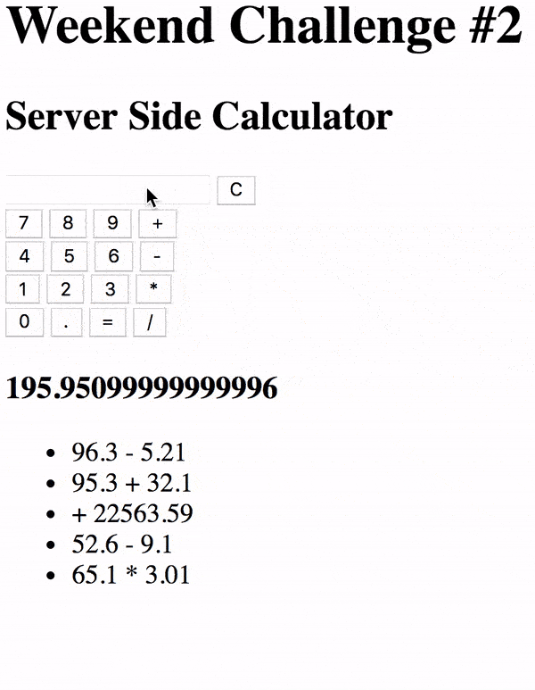

# Weekend Challenge: Server Side Calculator

Welcome to the weekend challenge!

You are going to be building a server-side calculator. The logic for the calculator **must** be implemented on the server. 

## Required Features

### Calculator

-[x] create file structure, create package.json, and install express
-[x] write server code and test that server is listening on specified port
-[x] source in jQuery, JS, and CSS files and test that they are sourced properly
-[x] build out HTML structure for base mode functionality

Create a user interface where the user can input two values (2 input elements) and the select type of mathematical operation. When the submit (`=` button) is clicked, capture this input, bundle it up in an object, and send this object to the server via a POST. There should also be a 'C' button that will clear the user input fields.

-[x] click handler for clear button to clear input fields
-[x] need a function to identify which of the math operator buttons was last clicked, then use that the value of operator property in the newEquation object being posted to the server
-[x] click handler for the equals button
-[x] equals button function needs to create a newEquation object that will be posted to the server with the properties: number-one, operator, number-two.
-[x] create a getEquation function using ajax that will receive the updated equation array and display content on the DOM
-[x] create sendEquationToServer function with ajax post request
-[x] do the math on the server side
-[x] equation history needs to stay on the DOM when the page is refreshed
    the history already exists after page refresh but it doesn't show until i click the submit button again. create a get request on page load to display existing equation history

Build out the server-side logic to compute the numbers as appropriate. The server should be able to handle Addition, Subtraction, Multiplication, and Division. Once the calculation is complete, send back the OK. You should do a GET request after the POST to get the actual calculation.

### History

Keep a historical record of all math operations and solutions on the server. Display a list of all previous calculations on the page when it loads using a GET request. Update the list when a new calculation is made.

> NOTE: History should exist even after refreshing the page. It's expected that the history will go away after restarting the server. We'll talk about long term data storage next week.

---

---

> Note: Do not use eval() to complete this assignment.

## Stretch Goals

- Convert the interface to look and behave like a calculator as shown below.

- [x] in index.html create calculator interface buttons, field to display clicked input
- [x] in style.css use grid or flexbox (probably) to format the buttons and field
- [x] in client.js create function(s) that capture the button clicks and display that input in the input field
      click handler for .calc-input
      function in click handler uses .this to capture the data-mode of the clicked button
      that data mode is displayed in the input field
- [x] update clearInputs
- [x] post request triggered on click of the = button
- [x] string of input sent to the server
- [] string is somehow interpreted as an equation and the result is calculated
      maybe use .includes to locate math operators
- [] result is added as an object property
- [] the object is pushed into the equations array
- [] success response sent to the client
- [] client side get request receives the updated array of equations and displays the result of the most recent submittal

  *Interfaces that mirror real world objects are often more intuitive and self-explanatory for users.*

---

---

- Only allow the POST call to happen if all necessary input is ready.

  *Data integrity is superfluously important! Sometimes users hit tje "go button" without fully inputting the needed fields. Show an alert if they left something empty and don't send bad or incomplete data to the server.*

- Allow a user to clear the history by clicking on a button. Technically this shouldn't be a GET or a POST. Look into making a DELETE request!

  *GETs are used to, well, get information from the server. POSTs are used to send new info to the server. DELETEs are used for, you guessed it, deleting info already on the server.*

- Allow a user to click on an entry in the History list to re-run that calculation. This should display the answer on the calculator interface like a normal calculation.

  *Anticipating a user's wants and adding the feature in the interface is often a logical progression that ends up in stretch goals for project.*

